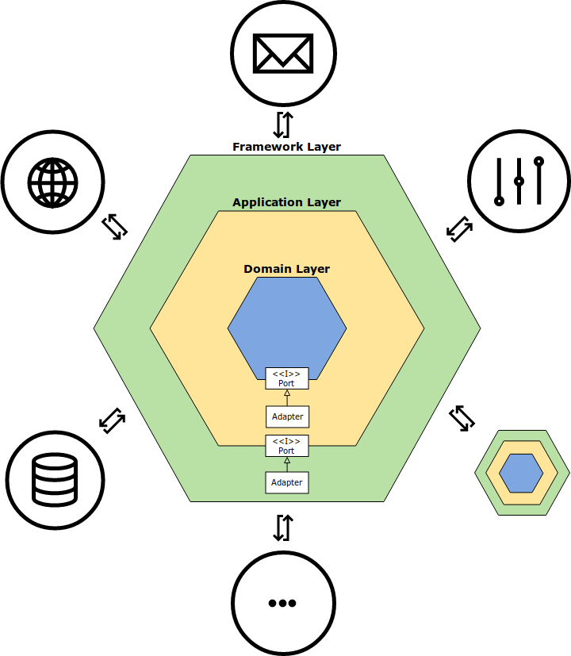
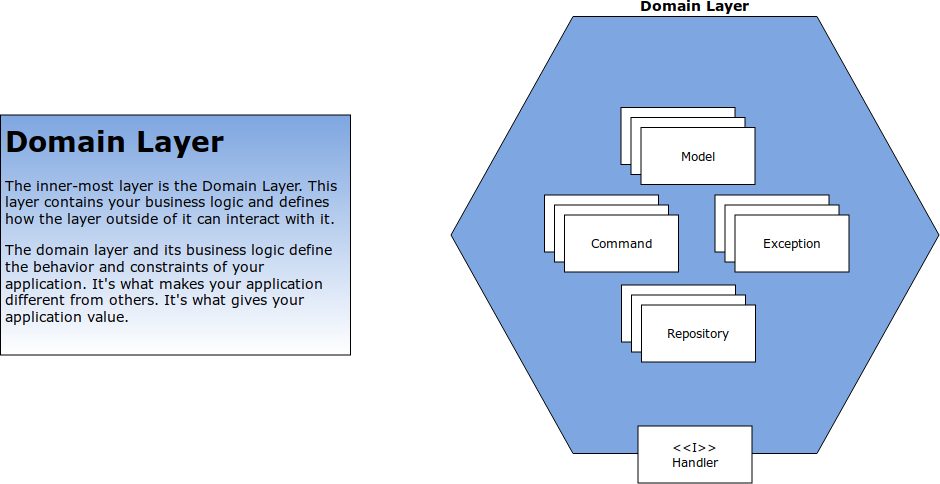
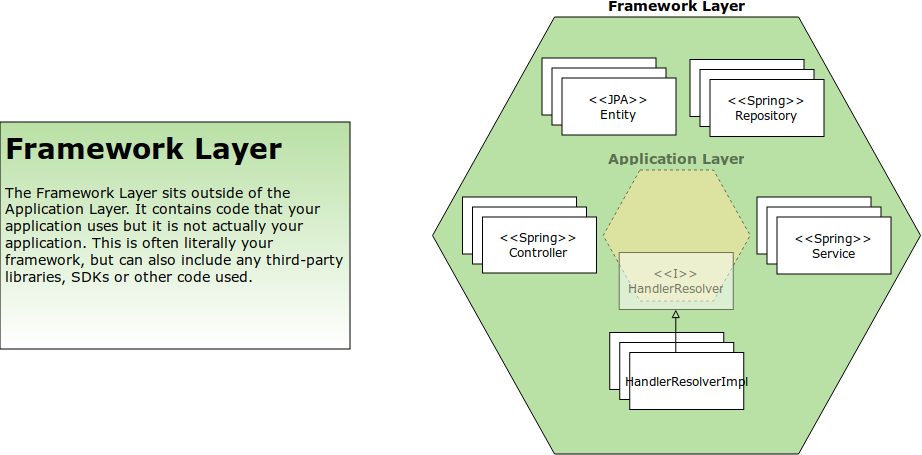

# spring-boot-hexagonal
A quickstart project for "spring-boot-gradle"-based java applications, using a hexagonal architecture.

## Architecture

### Overview



### Domain Layer



### Application Layer


### Framework Layer



## Dependencies

- Docker & docker-compose
- MongoDB
- JDK 8

## Build

To build the application, run the following:

```bash
./gradlew build docker
```

To check if everything is fine, run the following:

```bash
docker images
```

The expected result is something like this:

```bash
REPOSITORY                                         TAG                 IMAGE ID            CREATED             SIZE
com.paavieira.quickstarts/spring-boot-hexagonal   latest              9188c6086161        9 minutes ago       133MB
mongo                                              latest              14c497d5c758        2 weeks ago         366MB
openjdk                                            8-jdk-alpine        224765a6bdbe        4 months ago        102MB
```

## Run

To run the application, run the following command:

```bash
docker-compose up --build -d
```

To check if everything is fine, run the following:

```
curl http://localhost:8080/customers/
```

The expected result is something like this:

```json
[
  {
    "id": "5afdbd55a7b11b00010ce85d",
    "firstName": "Adam",
    "lastName": "Smith"
  },
  {
    "id": "5afdbd55a7b11b00010ce85e",
    "firstName": "Karl",
    "lastName": "Marx"
  }
]
```

## API docs

With the application running, you can check the API docs at the following URL:

http://localhost:8080/swagger-ui.html